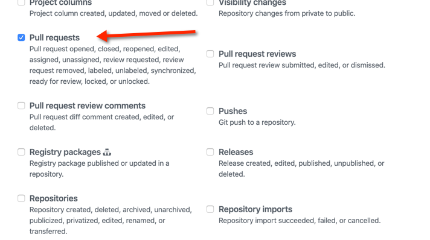
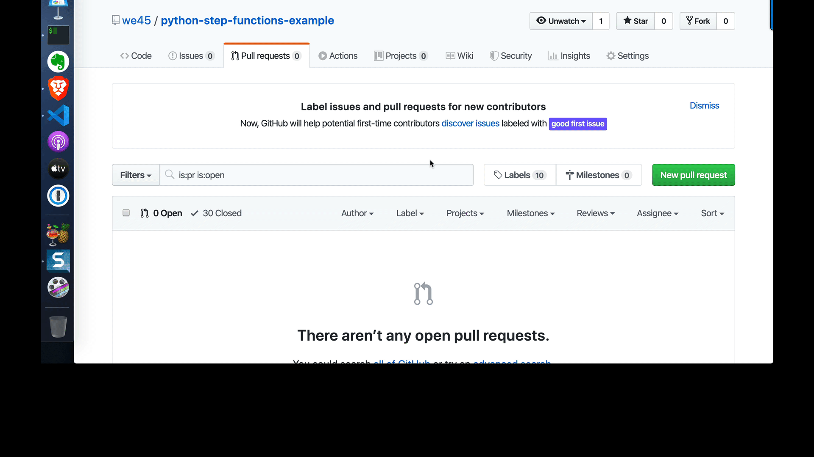

# Step Functions - Github PR Scan Pipeline

**This has to be run with an environment that has `awscli` pre-installed AND configured**

#### Step 1 

* Sign up for a Github Account
* Generate a Github Personal Access Token like [this](https://docs.cachethq.io/docs/github-oauth-token)
    * In the list of `scopes`, make sure you only select `public_repo`
* Make sure you copy the Github Token somewhere on your host machine. It is not visible once you navigate away from the page/refresh the page
* Open the lab image and open terminal in the IDE

#### Step 2

```bash
cd /root

git clone https://github.com/we45/pr-step-function-pipeline

cd /root/pr-step-function-pipeline
```

#### Step 3
```bash
aws ssm put-parameter --name "auth_token " --value "<copied token value>" --type "SecureString"

```

#### Step 4 
```bash
sls deploy
```

Wait for the Stack to be deployed

Copy the URL that is returned after the deployment process

#### Step 5

* In Github create a new project called "python-pr-example" and make sure to leave it private

* Use this link to setup a project webhook for the project. Make sure:
    * you set the content-type to `application/json`
    * Paste the URL generated from your `sls deploy` as the webhook URL
    * You can leave the `Secret` field empty although you should not do so in production
    * Ensure that you only select the `Pull Request` option from the webhook events



* Once the webhook is setup, go back to your terminal in the lab image

#### Step 6

In the terminal

```bash

cd /root

git clone https://github.com/<your-user-name>/python-pr-example

cd /root/python-pr-example
```
* Ensure you substitute `<your-user-name>` with your github username

#### Step 7

Now lets create an obviously insecure python code snippet. 


```python

import hashlib

password = "hello world"

hash_value = hashlib.md5(password).hexdigest()
```

* Copy the contents of the above into a file and save it as `hello.py`

Now create another file 

```bash
echo "pyjwt==1.5.0" > requirements.txt
```


#### Step 8
* Create a branch and push it to github

```bash
git checkout -b test

git push -u origin test
```

#### Step 9
Now go over to github and make a pull request. 
Make sure the `compare` branch is set to `test` and the base branch is `master`



Once you are done click on the `create pull request` button

#### Step 10

You should see your step functions run and write results to the PR in a few seconds. 